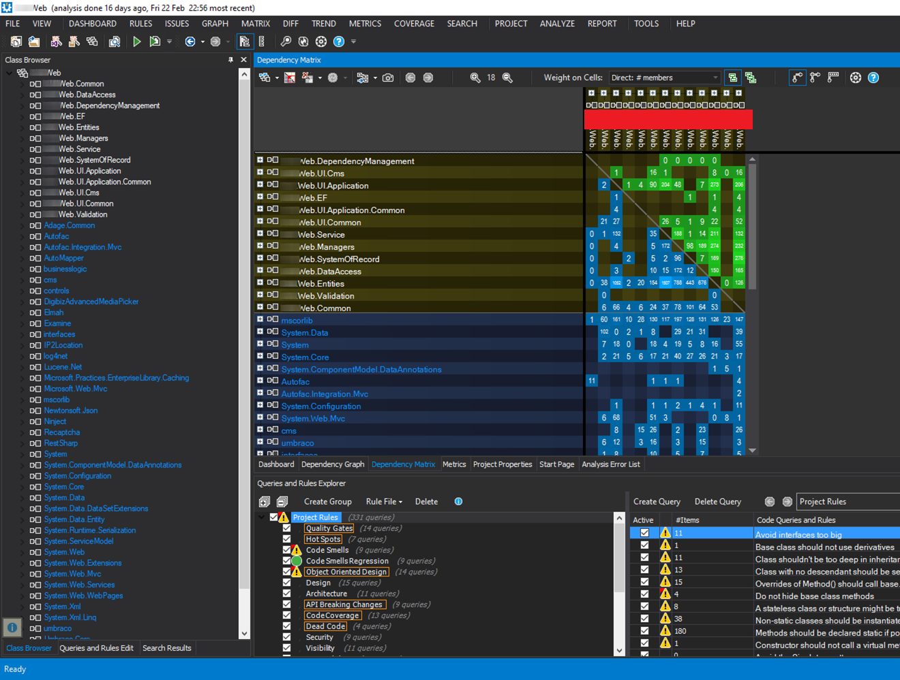

#  Trash PaNDA #

### What is Trash PaNDA? ###

Trash PaNDA is a tool to mask text from your images using [SixLabors' ImageSharp](https://github.com/SixLabors/ImageSharp) and [Microsoft's Computer Vision API](https://docs.microsoft.com/en-us/azure/cognitive-services/Computer-vision/Home).  
Think of it as an automated redaction tool - just like you see with the odd Government report or statement.
I initially designed it to be used to mask client names from screenshots of my code and tool windows, to comply with non-disclosure agreements (NDAs).

### How do I use it? ###

Download with Chocolatey: `choco install trashpanda`
Use in your own projects with Nuget: `Install-Package TrashPaNDA`
Or check out the Releases tab for nightlies.

1. Download, build the src\TrashPaNDA\TrashPaNDA.csproj.
2. Call TrashPandaHelper.ReplaceWordsInImage():  
   - `string apiKey` - your Cognitive Services API key;
   - `byte[] originalImage` - your original image stream in a byte array (ImageSharp will handle PNG, JPEG, GIF and BMP);
   - `string[] wordsToReplace` - an array of words to replace (case-insensitive);
   - `int scaleUp` - an optional scale factor to improve text recognition (leave as 1 & it'll scale automatically);
   - 'string endpoint' - optional, used to specify a specific Computer Vision API endpoint URI (see [here](https://westus.dev.cognitive.microsoft.com/docs/services/56f91f2d778daf23d8ec6739/operations/56f91f2e778daf14a499e1fa) for a list of acceptable endpoints)
3. Do what you want with the resulting `byte[]` - MemoryStream, save to file, etc.

### Contributing ###

PR's always accepted!

### Credits ###

ImageSharp is licensed under an Apache 2.0 License.  
Microsoft Cognitive Services API is licensed under an MIT License.  
The Trash PaNDA logo is courtesy of [Danielle Papanikolaou](https://pixabay.com/users/dazzleology-140326/) under the [Pixabay License](https://pixabay.com/service/license/).